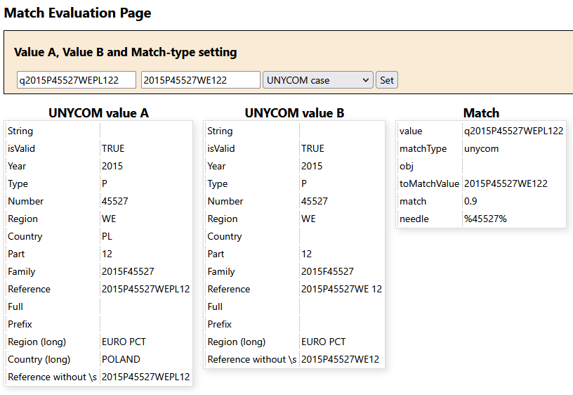

# Installation

You can use Packagist to install the package on a web server or your lacal computer, e.g. *Command Prompt*, enter `composer create-project sourcepot/asset {add your target directory here}`. 

The following code examples require the namespace to be set to `namespace SourcePot\Asset;`.

## Features
- Simple and complex value matches, from simple string contain to UNYCOM cases
- Extraction of a 'needles' from the input value used to pre-filter database entries and create a haystack
- Returns a match probability between the input value and entries of the haystack

# Sample code
```
namespace SourcePot\Match;

require_once('../../vendor/autoload.php');

$matchObj = new MatchValues();  // create instance of match object

$matchObj->set('q2015P45527WEPL122','unycom'); // set the value you like to match with other values of a haystack and set match type

$needle=$matchObj->prepareMatch();  // prepare the match, this will also return a needle, e.g. to filter entries from a database to create the haystack

$match=$matchObj->match('2015P45527WE122'); // match with a value of the haystack, typically used in a loop. $match is a value in the range of 0...1

$result=$matchObj->get();   // get all data with regard to the match, input values, needle, match type and match value
```

# Evaluation web page

An evaluation web page is provided with this package. Here is a screenshot of the evaluation web page:
